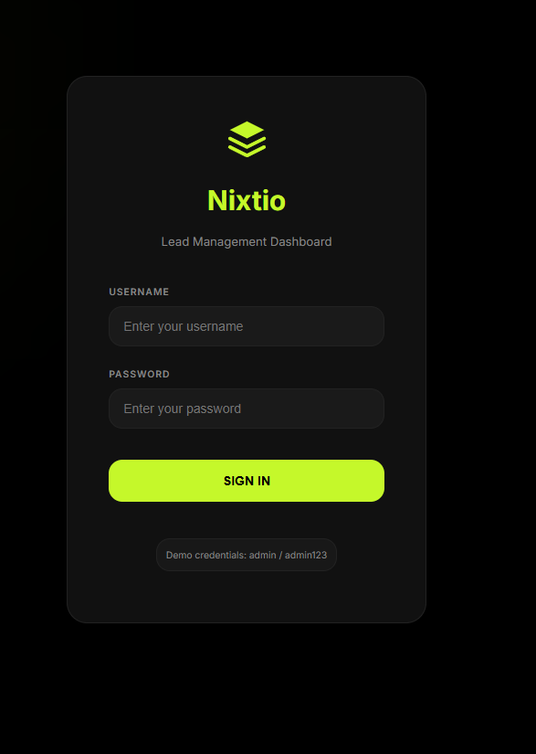
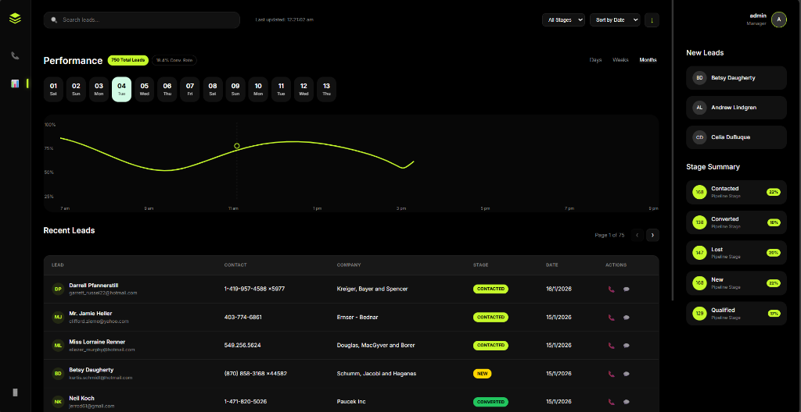

# Lead Management Dashboard

A full-stack CRM-style Lead Management Dashboard built with MongoDB, Express, React, and Node.js.

## 🚀 Features

- **Authentication**: Simple JWT-based authentication
- **Lead Management**: View, search, filter, and sort leads
- **Analytics Dashboard**: Real-time metrics including total leads, conversion rates, and stage breakdowns
- **Responsive Design**: Mobile-friendly interface that works on all devices
- **Advanced Filtering**: Filter by stage, status, and search across multiple fields
- **Pagination**: Efficient data loading with server-side pagination
- **Modern UI**: Clean, professional design with smooth animations

## 🛠️ Technology Stack

### Backend
- Node.js
- Express.js
- MongoDB with Mongoose
- JWT for authentication
- Faker.js for generating dummy data

### Frontend
- React 18
- Vite
- React Router v6
- Axios
- Modern CSS

## 📋 Prerequisites

- Node.js (v16 or higher)
- **Docker Desktop** (recommended for easiest setup)
- **OR** MongoDB Atlas account (if not using Docker)
- npm or yarn

## 🔧 Installation & Setup

### Option 1: Docker Setup (⚡ Recommended - Easiest!)

**Fastest way to get started:**

```bash
# 1. Clone the repository
git clone <your-repo-url>
cd Lead_Management_Dashboard

# 2. Start MongoDB and Backend with Docker
docker-compose up -d

# 3. Seed the database (wait 30 seconds after step 2)
docker-compose exec backend npm run seed

# 4. Start the frontend
cd frontend
npm install
npm run dev
```

**Done!** Visit http://localhost:5173 and login with `admin` / `admin123`


---

### Option 2: Manual Setup (Using MongoDB Atlas)

<details>
<summary>Click to expand manual setup instructions</summary>

#### 1. Clone the repository

```bash
git clone <your-repo-url>
cd Lead_Management_Dashboard
```

#### 2. MongoDB Atlas Setup

1. Go to [MongoDB Atlas](https://www.mongodb.com/cloud/atlas)
2. Create a free account and cluster
3. Create a database user
4. Whitelist your IP address (or use 0.0.0.0/0 for all IPs)
5. Get your connection string

📖 **MongoDB Atlas Setup:**
1. Create a cluster on [MongoDB Atlas](https://www.mongodb.com).
2. Get your connection string: `mongodb+srv://<username>:<password>@cluster0.mongodb.net/<dbname>`

#### 3. Backend Setup

```bash
cd backend
npm install

# Create .env file
echo "MONGODB_URI=your_connection_string" > .env
echo "JWT_SECRET=your_jwt_secret" >> .env
echo "ADMIN_USERNAME=admin" >> .env
echo "ADMIN_PASSWORD=admin123" >> .env


# Seed the database
npm run seed

# Start the backend
npm run dev
```

The backend will run on `http://localhost:5000`

#### 4. Frontend Setup

```bash
cd frontend
npm install

# Start the frontend
npm run dev
```

The frontend will run on `http://localhost:5173`

</details>


## 📝 API Documentation

### Authentication

**POST** `/api/auth/login`
- Body: `{ username, password }`
- Returns: JWT token

### Leads

**GET** `/api/leads`
- Query params:
  - `search`: Search term
  - `stage`: Filter by stage (New, Contacted, Qualified, Converted, Lost)
  - `status`: Filter by status (Active, Inactive, Pending)
  - `sortBy`: Field to sort by
  - `sortOrder`: asc or desc
  - `page`: Page number
  - `limit`: Items per page
- Requires: JWT token

**GET** `/api/leads/:id`
- Returns: Single lead details
- Requires: JWT token

### Analytics

**GET** `/api/analytics/summary`
- Returns: Analytics data (total leads, conversion rate, breakdowns)
- Requires: JWT token

## 🔐 Default Credentials

- **Username**: admin
- **Password**: admin123

(Change these in your `.env` file)

## 📊 Database Schema

```javascript
{
  name: String,
  email: String (unique),
  phone: String,
  company: String,
  stage: Enum ['New', 'Contacted', 'Qualified', 'Converted', 'Lost'],
  status: Enum ['Active', 'Inactive', 'Pending'],
  notes: String,
  createdAt: Date
}
```

## 🎨 Screenshots

### Login View


### Dashboard View



## 📦 Project Structure

```
Lead_Management_Dashboard/
├── backend/
│   ├── src/
│   │   ├── models/
│   │   ├── routes/
│   │   ├── middleware/
│   │   ├── config/
│   │   └── server.js
│   ├── scripts/
│   │   └── seed.js
│   └── package.json
├── frontend/
│   ├── src/
│   │   ├── components/
│   │   ├── context/
│   │   ├── utils/
│   │   └── App.jsx
│   └── package.json
└── README.md
```

## 🤝 Contributing

Feel free to submit issues and enhancement requests!

